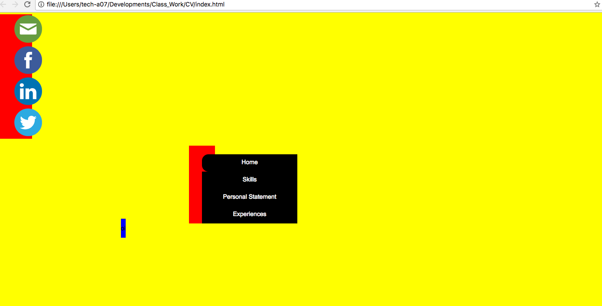

# MyProject

## Description 
My project is working on my Cirriculum Vitae and providing the details for this on a web page. This is working progress which will be updated, throughout my period at Sparta Global. 

## Technologies Used
The following technologies are what I have currently been using to deploy and implement the web page for my CV:

* HTML
* CSS
* Interactive - CSS

## Instructions 
To access my web profile the following link is required 
```bash
index.html 
```
## Update Screenshots 

[Link to my website](index.html)



